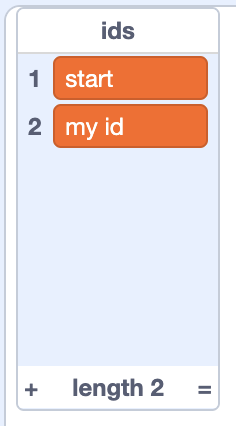
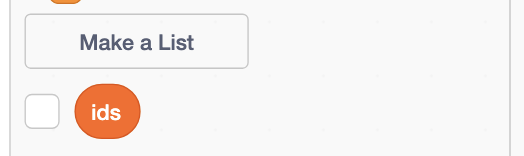

## Start your level

--- task ---

Open the starter project at [rpf.io/pp](https://rpf.io/pp-starter){:target="_blank"}

--- /task ---

The project has two sprites. **player** is the sprite that will move between levels. **id floor** is a sprite that will act as a platform, and that you can copy to make other platforms.

--- task ---

Choose an id or ask your club leader or teacher for one.

- If you are making a colaborative project with other people in your club or class, it might be your name. *e.g. ellis*
- If you are making a colaborative project with other clubs or classes, it might be your club or class name. *e.g. hull code club or e.g. 7C*

--- /task ---

--- task ---

Change the name of the **id floor** sprite to use your new **id**. *e.g. ellis floor or hull code club floor*

--- /task ---

--- task ---

In the code for the floor sprite, change the `wait until`{:class="block3control"} blocks, to they are waiting until the `id`{:class="block3variables"} variable matches your new **id**.

```blocks3
when flag clicked
hide
+wait until <(id) = [my id]>
+wait until <not<(id) = [my id]>>
hide
```

--- /task ---

--- task ---

Add a new message so that the `broadcast`{:class="block3control"} waits for your **id** to be broadcast.

```blocks3
+when I receive [my id v]
show
set [x position v] to (-180)
set [y position v] to (0)
go to x:(90) y:(-160)
```

--- /task ---

--- task ---

Add your **id** to the `ids`{:class="block3variables"} list.



--- /task ---

--- task ---

Hide the `ids`{:class="block3variables"} list.



--- /task ---

--- task ---

Click the green flag. The player sprite should be positioned in the bottom left of the screen.

Press **n** on your keyboard.

The floor sprite should appear, and the player sprite change position and fall on to it.

You can move the player sprite using the left and right arrow keys, and use the up arrow key to jump. (⬅️⬆️➡️)

--- /task ---