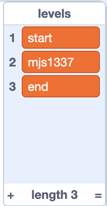

## Start your level

--- task ---

Open the starter project at [rpf.io/patchwork-game](https://rpf.io/patchwork-game){:target="_blank"}

--- /task ---

The project has two sprites.

Click the green flag to start the game.
1. On the first level the green player sprite will fall to the floor. Use the right arrow key (➡️) to move the player sprite to the end of the screen.
2. The next level will start, showing the Scratch cat appear for three seconds.
3. The next level will start. Move the purple player sprite to the end of the screen to start the game again.

You're going to make your own level, adding your own sprites and code.

--- task ---

Choose a name for your level. It has to be unique to you, and something nobody else would choose. It's a little like a username.

Replace `my level`{:class="block3variables"} in the `levels`{:class="block3variables"} list, so that your level name appears as the second item.



--- /task ---

`my level cat` is a sprite that has the scripts you need for your level.

--- task ---

This script makes sure that your sprites appears at the start of your level and dissappears when your level has been completed.

Edit the `wait until`{:class="block3control"} blocks, so that `level`{:class="block3variables"} is compared to the level name you added to the list.

```blocks3
when i receive [start v]
hide
+ wait until <(level) = [my level]> //change this to your level name
+ wait until <not<(level) = [my level]>> //change this to your level name
hide
stop [other scripts in sprite v]
```

--- /task ---

--- task ---

Edit the script that starts your logic, by adding a broadcast that matches your level name.

Change the `say`{:class="block3looks"} block so the cat says something different.

+ when I receive [my level v] //add a broadcast message matching your level name
show
+ say [my easy level] for [3] seconds //add your own message here to test

--- /task ---

--- task ---

Click the green flag.

Complete the first level by moving the player sprite to the right of the screen.

Make sure that the Scratch cat still appears and says the text your wrote.

--- /task ---
