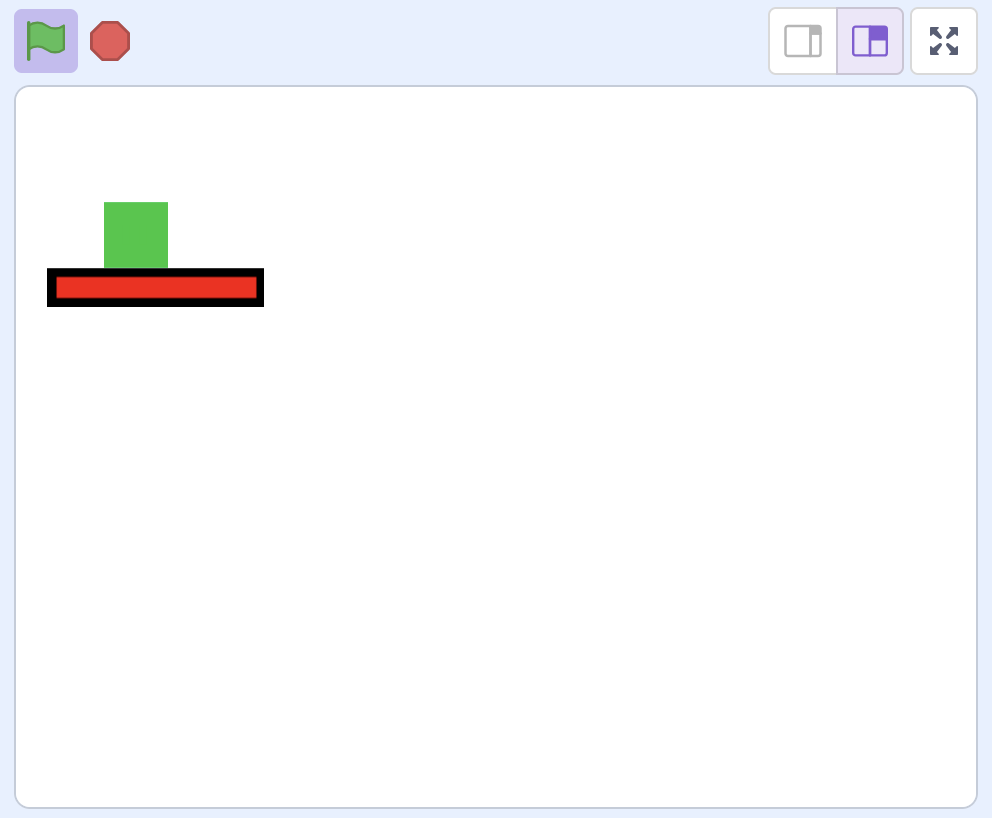

## Postion your player and floor

At the start of your level, you can decide where the player sprite starts and where the floor is positioned.

The starting position of the player is set by the `x positon`{:class="block3variables"} and `y position`{:class="block3variables"} variables.
The starting positon of the floor **must be set using** the `go to `{:class="block3motion"}

--- task ---

Change the starting position of the floor and the starting position of the player. This can be anywhere on the screen that you like.

```blocks3
when I receive [my id v]
show
+set [x position v] to (-180)
+set [y position v] to (0)
+go to x:(90) y:(-160)
```

Click the green flag and then press **n** to test the positions.

--- /task ---

You can change the floor into a platform if you like. It depends on what your level is going to look like. Change the size of the sprite, its colour, and then it's positon. It must have a black outline though, so that the player can collide with it.

