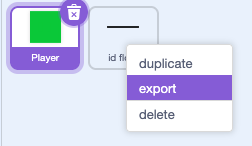
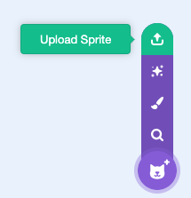

## Share your level

--- task ---

When you are happy that your level works, save your project and share it with whomever is going to stitch the levels together.

--- /task ---

--- collapse ---

---

title: Stitching the project together

---

1. Open the project that has been shared with you.
2. Click on each of the sprites that are in the project and export them.

3. Open the original starter project and remix it.
4. Import all the sprites you exported.

5. Repeat for each project that has been shared with you.
6. Add the unique identifiers to the levels list, between the 1st and last level.

--- /collapse ---